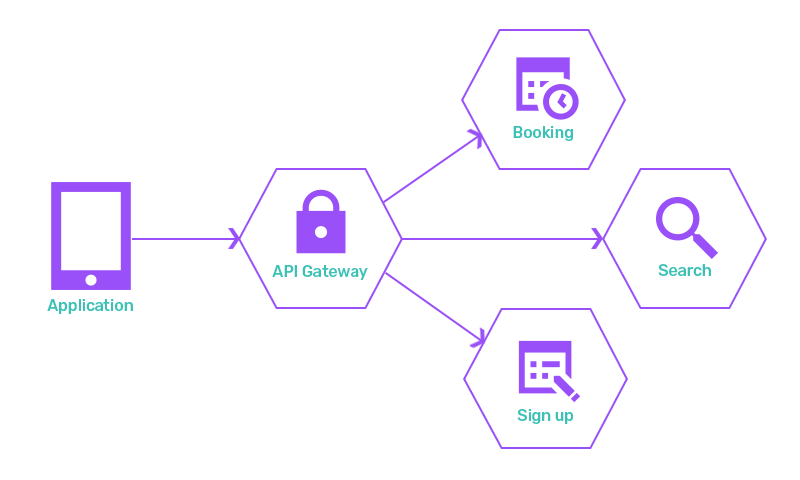

webMethods Microgateway
========================

webMethods Microgateway is a lightweight distributed proxy that gives control over a microservices landscape by enforcing policies which perform authentication, traffic monitoring, and traffic management near the service end points. The lightweight nature of a Microgateway allows a flexible deployment to avoid gaps or bottlenecks in the policy enforcement. Microgateway enables microservices to communicate with each other directly without the need for API Gateway. This eases the traffic overload on API Gateway and reduces the latency in the communication round trip. The required protection policies can be enforced on the Microgateway to establish a secure communication channel between the microservices. 

The above diagram shows microservices implementing the booking related API of the imaginary company NodeTours. The shown microservice mesh or microservice landscape consists of three services. Consumer applications access the APIs via a central API Gateway that performs the enforcement of policies. The problem here is that each microservice exposes an endpoint where no policy enforcement is done.  Moreover, considering the microservices are interacting with each other all this traffic needs to be routed through the single API Gateway. This leads to additional network latency and the API Gateway potentially becomes a bottleneck. The diagram below shows a deployment where the API Gateway is replaced with a set of Microgateways that are added to the microservices itself. Such a "sidecar" deployment does not leave any gaps and avoids bottlenecks in the policy enforcement. 

API Gateway Integration
----------------------------

The Microgateway’ s responsibility is focused on a single microservice or a small number of microservices. To manage a microservice landscape an API Gateway is needed. It offers the UI for configuring policies and for system configurations. Moreover, it is responsible for monitoring the traffic across the microservice landscape. The following figures shows how Microgateways are interacting with an API Gateway.

API Gateway vs Microgateway
----------------------------

API Gateway is used to expose services that provides complete end to end capability. API Gateways are generally designed as centralized gateways hosted on cloud or on-premise. Microgateways are designed as decentralized gateways that can hold single or few APIs. The flexible deployment nature of Microgateway makes it ideal for low latency small footprint solutions. Microgateways are best suited for microservices architectures with greater flexibility of horizontal scaling. 

Components of Microgateway
---------------------------

The Microgateway service runs within its own Java runtime environment and is controlled by a simple command line interface that supports basic lifecycle operations like start and stop. The configuration of the service consists of system settings and assets that can be provisioned from a running API Gateway or can be provisioned through a filesystem. The provisioned assets include Application, API, Policy, and Alias definitions. The Microgateway service exposes an administrator REST API to query the status, the system setting, and the provisioned assets. Microgateway has a service to enforce the policies on REST APIs. 

Get Microgateway
--------------------

Software AG Microgateway is part of webMethods API Management platform (link - https://www.softwareag.com/en_corporate/platform/integration-apis/api-management.html). webMethods API Gateway can be provisioned in multiple ways based on the users needs. 

Docker - Microgateway docker image can be pulled from the docker hub. https://hub.docker.com/_/softwareag-microgateway-trial
After the checkout, check the "How to use" page which lists the detailed steps for spinning up a container with the docker image. Please follow the steps and get your instance started in few minutes.

On-Premise Installation – Microgateway on-premise installation can be downloaded and installed from Software AG empower. link - https://empower.softwareag.com/

Links to Tech-Community Articles
-------------------------------------------

https://tech.forums.softwareag.com/t/running-microgateway-10-5-in-a-windows-container/237522
https://tech.forums.softwareag.com/t/getting-started-with-webmethods-microgateway-dockerhub-image/237332
https://tech.forums.softwareag.com/t/microgateway-instance-based-provisioning/239201
https://tech.forums.softwareag.com/t/microgateway-configuration/239202
https://tech.forums.softwareag.com/t/managing-microgateways/239203
https://tech.forums.softwareag.com/t/microgateway-integration-with-service-registry-and-api-portal/237259

Policies in Microgateway
-------------------------

Microgateway supports subset of policies supported by API Gateway. Policies are configured in API Gateway and provisioned to Microgateway. Microgateway neglects the policies that are not supported.
* Transport: Microgateway supports only Enable HTTP/HTTPs policy in transport. 
* Identify and Access: Microgateway supports the REST APIs and do not support the SOAP and OData APIs. Therefore, policies related to SOAP and OData APIs are not supported. Policies supported by Microgateway for Identify and Access are 
	* Authorize user - Microgateway authorizes users against copy of IntegrationServer\instances\default\config\users.cnf which is created during Microgateway start-up. This policy should be used together with an authentication policy (for example, Require HTTP Basic Authentication). Authorize user policy validates the incoming request against list of users, groups or access profiles. 
	* Identify and Authorize application - This policy allows client applications to access APIs depending on the identification type specified. Identification types supported are API Key, Hostname, HTTP Basic Authentication, IP address range, OAuth2 token, JWT, OpenID connect, SSL Certificate and Payload element.
	Microgateway is created using the required applications pulled during start-up. Any changes to applications are synched using polling mechanism.  To avoid the consumption of a considerable amount of memory and CPU, the API Provider provides certain configurations for polling the applications. Ex: list of application ids, registered applications of the APIs in Microgateway or all global applications.
* Request Processing: Policies supported in request processing are,
	* Request transformation - Microgateway request transformation supports subset of policies supported by API Gateway. For example, advance transformation, JMS properties etc are not supported. Additional details can be found in product documentation https://documentation.softwareag.com/webmethods/microgateway/yam10-5/10-5_Microgateway_webhelp/index.html#page/microgateway-webhelp%2Fre-policy_requestproc_transform.html%23
	* Validate API specification - This policy validates incoming request against schema, query parameters, path parameters, content-types, and HTTP headers.
	* Data Masking - Data masking is a technique of masking sensitive fields. Data masking is applied at application level. It mandates Identify and Access policy to be configured to identify an application. If no application is specified masking is applied on all requests. Masking criteria can be applied to XPath, JSONPath, and Regex expressions based on the content-type. This policy can also be applied on API scopes. 
* Routing: Microgateway supports routing policies as below,
	* Straight-through routing
	* Content-based routing
	* Context-based routing
	* Out-bound Authentication - Transport
* Traffic Monitoring - Microgateway supports all Traffic Monitoring policies except Service Result Cache. 
Policies supported are 
	* Log Invocation - In log invocation policy Microgateway supports the below properties. Store Request, Store Response, Compress Payload data, Log Generation Frequency and Destination (API Gateway and Elasticsearch). Microgateway does not support other destinations, only API Gateway and Elasticsearch is supported. 
	* Monitor Service Level Agreement - This policy monitors a set of run-time performance conditions like availability, average response time, fault count, maximum response time, success count and total request count for one or more specified applications. This policy can be used to configure SLAs for each API or application or combination of both. If there is a breach in any of the parameters, an event notification (Monitor event) is sent to the configured destination. In a single policy, multiple action configurations behave as AND condition. The OR condition can be achieved by configuring multiple policies. Microgateway supports API Gateway and Elasticsearch as destinations. This policy action monitors run-time performance conditions within a single Microgateway instance. 
	* Monitor Service Performance - This policy is like the Monitor Service Level Agreement policy but enforces the run-time performance conditions at the API level. Parameters like success count, fault count, and total request count are immediate monitoring parameters and are evaluated as soon as the limit is breached. For the rest of the aggregated monitoring parameters, the evaluation happens after the configured interval. If there is a breach in any of the parameters, an event notification (Monitor event) is sent to the configured destination. Destinations supported are API Gateway and Elasticsearch. In a single policy, multiple action configurations behave as AND condition. The OR condition can be achieved by configuring multiple policies. This policy only monitors run-time performance conditions within a single Microgateway instance. 
	* Throttling Traffic Optimization - This policy limits the number of API invocations during a specific time interval. This policy only limits the number of API invocations within a single Microgateway instance. That is, the policy is not applicable across Microgateway instances holding the same APIs. Aggregation across multiple Microgateway instances is not supported. For destinations only API Gateway and Elasticsearch is supported.
* Response Processing - Microgateway supports all the response processing policies except Invoke webMethods IS. Below policies are supported, 
	* Response Transformation - Microgateway supports the following parameter types for the response transformation policy. response.payload, response.headers, response.statusCode and response.statusMessage
	* Validate API Specification - This policy validates outgoing response against schema, content-types, and HTTP headers.
	* CORS - The Cross-Origin Resource Sharing (CORS) mechanism is used to secure cross-domain requests and data transfers between browsers and web servers. The CORS standard works by adding new HTTP headers that allow servers to describe the set of origins that are permitted to read that information. The CORS response specifications that are supported by Microgateway are Allow Origins, Max age, Allowed Methods, Allow Headers, Allow Credentials and Expose Headers. 
	* Data Masking - Data masking is a technique of masking sensitive fields. Data masking is applied at application level. It mandates Identify and Access policy to be configured to identify an application. If no application is specified masking is applied on all responses. Masking criteria can be applied to XPath, JSONPath, and Regex expressions based on the content-type. This policy can also be applied on API scopes. 
* Error Handling - Microgateway supports Conditional Error Processing and Data Masking in Error Handling policies. 
* API Scopes - A scope represents a logical grouping of REST resources, methods, or both in an API. An API can have a set of declared scopes. API scopes are configured in API Gateway and provisioned to Microgateway. Only the following policies are supported for API Scopes in Microgateway.
	* Identify and Access policy: Identify and Authorize Application
	* Traffic Monitoring policies: Log Invocation, Throttling Traffic optimization
